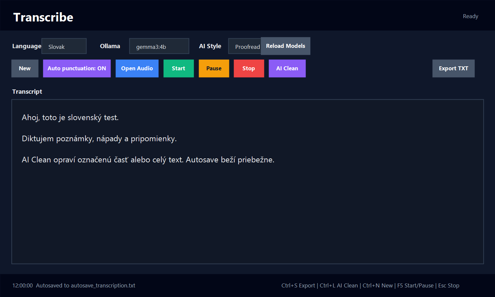

<a id="readme-top"></a>

<h3 align="center">Transcribe</h3>

<!-- TABLE OF CONTENTS -->
<details>
  <summary>Obsah</summary>
  <ol>
    <li><a href="#about-the-project">O projekte</a></li>
    <ul>
      <li><a href="#prerequisites">Požiadavky</a></li>
    </ul>
    <li><a href="#usage">Použitie</a></li>
    <li><a href="#roadmap">Postup</a></li>
    <li><a href="#additional-notes">Ďalšie poznámky</a></li>
    <li><a href="#contact">Kontakt</a></li>
  </ol>
</details>

<!-- ABOUT THE PROJECT -->
## O projekte

Tento nástroj slúži na rýchly prepis hovoreného textu do `.txt` súboru. Je pripravený hlavne na diktovanie väčších blokov textu, ktoré sa dajú neskôr upraviť, vyčistiť cez AI a uložiť ako čitateľný text.

Základná pipeline:

MP3 / M4A / WAV / mikrofón → prepis textu → úprava interpunkcie → AI kontrola → autosave → export TXT

Aplikácia podporuje:

- slovenčinu,
- angličtinu,
- otvorenie MP3, M4A, WAV a ďalších audio súborov,
- diktovanie cez mikrofón,
- jasné ovládanie diktovania cez Start / Pause / Stop,
- automatické prispôsobenie svetlej alebo tmavej Windows téme,
- AI kontrolu textu cez lokálne Ollama,
- výber Ollama modelu priamo v GUI,
- výber AI štýlu opravy,
- AI opravu celého textu alebo iba označenej časti,
- autosave do `autosave_transcription.txt`,
- automatickú výmenu hovorených interpunkčných príkazov,
- export výsledku do `.txt` so zalomenými riadkami.

### Riešenie

Celý workflow je postavený na jednoduchej myšlienke:

- používateľ vyberie jazyk,
- otvorí audio súbor alebo zapne mikrofón,
- aplikácia prepíše reč cez Google Speech Recognition,
- text sa priebežne automaticky zálohuje,
- voliteľne sa opraví cez Ollama,
- výsledok sa uloží ako TXT súbor.

Používa sa najmä:

- `speech_recognition` na rozpoznávanie reči,
- `PyAudio` na mikrofón,
- `soundfile` na načítanie audio súborov,
- `moviepy` na M4A / MP4 / AAC audio,
- `Ollama` na lokálnu AI kontrolu textu,
- `tkinter` na grafické rozhranie.

### GUI

Hlavné okno aplikácie:

<p align="center">
  
</p>

Aplikácia si pri štarte zistí, či Windows používa svetlý alebo tmavý režim, a podľa toho nastaví farby rozhrania.

<p align="left">(<a href="#additional-notes">podrobnejšie informácie v časti Ďalšie poznámky</a>)</p>

<p align="left">(<a href="#readme-top">späť na začiatok</a>)</p>

<!-- GETTING STARTED -->
## Začíname

<p align="left">(<a href="#readme-top">späť na začiatok</a>)</p>

### Požiadavky

Potrebujete:

- Python,
- funkčný mikrofón, ak chcete diktovať priamo,
- internetové pripojenie pre Google Speech Recognition,
- Ollama, ak chcete používať AI kontrolu textu,
- nainštalované Python knižnice.

Inštalácia knižníc:

```bash
python -m pip install SpeechRecognition soundfile PyAudio moviepy edge-tts lameenc
```

AI kontrola používa lokálne Ollama. Modely sa načítajú automaticky z Ollama. Ak chcete použiť aktuálne nastavený model:

```bash
ollama pull gemma3:4b
```

<p align="left">(<a href="#readme-top">späť na začiatok</a>)</p>

<!-- USAGE EXAMPLES -->
## Použitie

### Spustenie aplikácie

Spustite GUI aplikáciu:

```bash
python transcribe.py
```

Po spustení vyberte:

- jazyk `Slovak` alebo `English`,
- Ollama model,
- AI štýl opravy.

### New

Tlačidlo `New` vyčistí aktuálny text po potvrdení. Použite ho, keď chcete začať nový diktát.

### Open Audio

Tlačidlo `Open Audio` otvorí výber audio súboru.

Podporované vstupy:

- MP3,
- M4A,
- WAV,
- FLAC,
- AIFF,
- OGG,
- AAC,
- MP4 / MOV audio.

Po výbere súboru aplikácia prepíše reč a vloží výsledok do hlavného textového poľa.

### Start / Pause / Stop

Tlačidlá na diktovanie:

- `Start` začne počúvať mikrofón,
- `Pause` dočasne zastaví diktovanie,
- `Resume` pokračuje po pauze,
- `Stop` ukončí diktovanie.

Pri diktovaní sa text pridáva priebežne do hlavného poľa. Nové časti diktovania sa pripájajú do jedného plynulého textu. Nový riadok alebo odstavec vznikne iba vtedy, keď ho nadiktujete cez príkazy ako `nový riadok`, `nový odstavec`, `new line` alebo `new paragraph`.

### Auto Punctuation

Tlačidlo `Auto punctuation: ON/OFF` určuje, či sa hovorené interpunkčné príkazy zmenia na skutočné znaky.

Slovenské príkazy:

```text
bodka
koniec vety
čiarka
enter
nový riadok
nový odstavec
odrážka
nová odrážka
novú odrážku
ďalší bod
nadpis
otáznik
výkričník
otvor zátvorku
zatvor zátvorku
```

Anglické príkazy:

```text
period
comma
new line
new paragraph
bullet point
next bullet
heading
question mark
exclamation mark
open bracket
close bracket
```

### AI Clean

Tlačidlo `AI Clean` pošle text do lokálneho Ollama modelu. Ak je v texte označená iba časť, opraví sa iba výber. Ak nie je označené nič, opraví sa celý text.

AI štýly:

- `Proofread` - neutrálna korektúra,
- `Clean notes` - čisté poznámky,
- `Polish` - mierne uhladený text,
- `Keep raw meaning` - čo najmenší zásah do pôvodného znenia.

AI kontrola nemení úmysel textu a nemá text zhrnúť. Má iba upraviť prepis tak, aby bol čitateľnejší.

### Autosave

Aplikácia automaticky ukladá aktuálny text do:

```text
autosave_transcription.txt
```

Autosave beží približne každých 10 sekúnd a ignoruje prázdny úvodný placeholder.

### Export TXT

Tlačidlo `Export TXT` uloží aktuálny text z aplikácie do `.txt` súboru v kódovaní UTF-8.

Pri exporte sa dlhé riadky automaticky zalomia približne na 100 znakov. Text sa tak lepšie číta v bežnom textovom editore. Prázdne riadky, nadpisy a odrážky zostanú zachované.

Predvolený názov súboru:

```text
transcription_YYYY-MM-DD_HH-MM-SS.txt
```

### Klávesové skratky

```text
Ctrl+S  Export TXT
Ctrl+L  AI Clean
Ctrl+N  New
F5      Start / Pause / Resume
Esc     Stop dictation
```

<p align="left">(<a href="#readme-top">späť na začiatok</a>)</p>

<!-- ROADMAP -->
## Postup

<a id="roadmap"></a>

1. **Spustite aplikáciu**

   - Otvorte priečinok s projektom.
   - Spustite `python transcribe.py`.

2. **Vyberte jazyk a AI nastavenia**

   - Pre slovenčinu zvoľte `Slovak`.
   - Pre angličtinu zvoľte `English`.
   - Vyberte Ollama model a AI štýl.

3. **Zvoľte vstup**

   - Na existujúci súbor použite `Open Audio`.
   - Na živé diktovanie použite `Start`.

4. **Diktujte alebo prepisujte audio**

   - Pri dlhšom diktovaní používajte `Pause` a `Stop`.
   - Text môžete v hlavnom okne priebežne upravovať.
   - Autosave priebežne vytvára zálohu.

5. **Skontrolujte text cez AI**

   - Označte časť textu a kliknite `AI Clean`, ak chcete opraviť iba výber.
   - Bez výberu sa opraví celý text.

6. **Exportujte výsledok**

   - Kliknite na `Export TXT`.
   - Vyberte názov a umiestnenie výstupného súboru.

<p align="left">(<a href="#readme-top">späť na začiatok</a>)</p>

<!-- ADDITIONAL NOTES -->
## Ďalšie poznámky

<a id="additional-notes"></a>

### Slovenčina

Slovenčina funguje najlepšie, keď je vstup naozaj hovorený po slovensky. Pri diktovaní používajte radšej jednoduché interpunkčné príkazy ako `bodka`, `čiarka`, `enter`, `nový odstavec` alebo `ďalší bod`.

### Kódovanie

Výstupné TXT súbory sa ukladajú ako UTF-8. Ak PowerShell zobrazí znaky ako `á` alebo `ž`, problém je často iba v zobrazení terminálu, nie v samotnom súbore.

### Google Speech Recognition

Aplikácia používa online Google Speech Recognition cez knižnicu `speech_recognition`. Preto je potrebné internetové pripojenie.

### Ollama

AI Clean používa lokálne Ollama API:

```text
http://localhost:11434
```

Ak AI Clean nefunguje, skontrolujte:

```bash
ollama list
ollama pull gemma3:4b
```

### Odporúčaná logika práce

1. Zapnúť aplikáciu.
2. Vybrať jazyk.
3. Zapnúť `Auto punctuation`, ak chcete hovorené interpunkčné príkazy.
4. Použiť `Start` a diktovať text.
5. Použiť `Pause`, keď potrebujete prestávku.
6. Použiť `Stop`, keď je diktovanie hotové.
7. Skontrolovať text.
8. Použiť `AI Clean` na výber alebo celý text.
9. Exportovať TXT.

<p align="left">(<a href="#readme-top">späť na začiatok</a>)</p>

<!-- CONTACT -->
## Kontakt

Pre otázky otvorte GitHub Issue v tomto repozitári.
